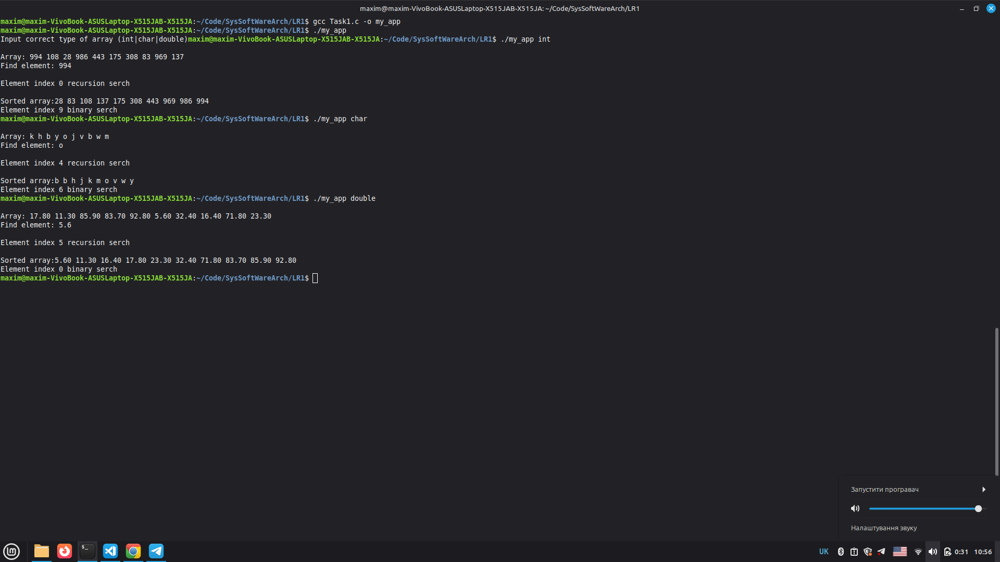

Лабораторна робота №1

**Виконав:** Найдюк Максим
**Група:** ТВ-43

## Завдання
Напишіть програму на ANSI C, яка працює з масивами довільного типу.
Заповніть масив випадковими значеннями, використовуючи покажчики.
Напишіть функцію пошуку заданого значення в цьому масиві за допомогою рекурсії.
Реалізуйте додаткову функцію для бінарного пошуку, якщо масив відсортований.
Додайте можливість вибору типу даних (int, float, char) через параметри командного рядка.

## Результат роботи

## Висновок
Розроблено програму на мові ANSI C, яка демонструє принципи низькорівневого маніпулювання даними та розробки універсальних (generic) алгоритмів.