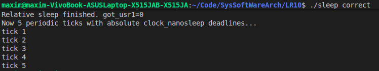
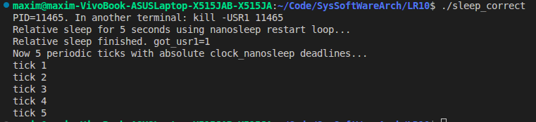
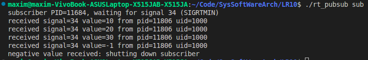
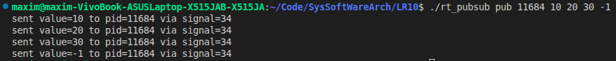
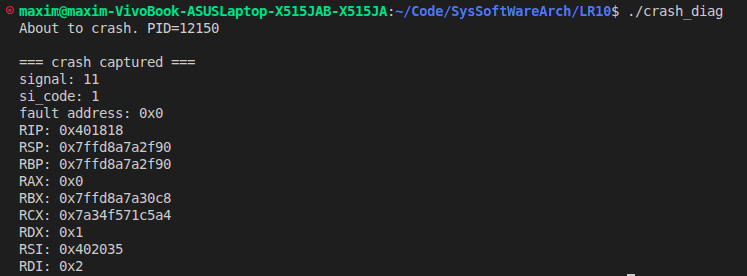
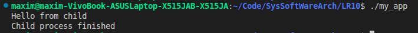

**ПРАКТИЧНА РОБОТА №10**

**Виконав:** Найдюк Максим
**Група:** ТВ-43

**Приклад 1(sleep_correct.c):**
Правильна організація пауз та таймерів у програмах, що обробляють сигнали.
**Результат роботи:**

Вирішує проблему переривання функції сну сигналами (помилка `EINTR`). Порівнює два підходи: відновлення відносного сну через `nanosleep` та створення точних періодичних таймерів без накопичення похибки (time drift) за допомогою абсолютного часу в `clock_nanosleep` (`TIMER_ABSTIME`).

**Приклад 2(rt_pubsub.c):**
Міжпроцесна взаємодія з передачею даних.
**Результат роботи:**

Реалізація архітектури "Видавець-Підписник". Показує, як надсилати корисне навантаження (числа) разом із сигналами через `sigqueue` та як синхронно і безпечно вичитувати їх з черги ОС за допомогою `sigwaitinfo` та `sigtimedwait` (блокуючи асинхронні переривання через `sigprocmask`)

**Приклад 3(crash_diag.c):**
Безпечна обробка критичних помилок (`SIGSEGV`, `SIGILL`).
**Результат роботи:**

Демонструє, як перехопити падіння програми за допомогою `sigaction`, отримати контекст процесора (`ucontext_t`) і вивести дамп регістрів. Ключова особливість — використання власних *async-signal-safe* функцій виводу через `write()`, щоб уникнути взаємних блокувань (deadlocks), які можуть виникнути при використанні стандартного `printf`

**Індивідуальне завдання:**

Змусьте дочірній процес виконати команду echo Hello from child, передаючи параметри через execlp().

**Результат роботи:**

Ілюструє фундаментальний механізм UNIX/Linux-систем — патерн Fork-Exec-Wait (базова модель роботи будь-якої командної оболонки, як-от bash). Демонструє, як батьківський процес створює свою точну копію (`fork()`), після чого дочірній процес замінює свій код на команду `echo` з передачею параметрів (`execlp()`), а батько безпечно очікує на її завершення (`wait()`).

