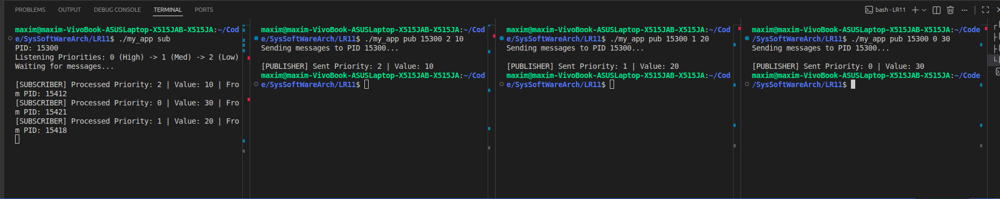

**ПРАКТИЧНА РОБОТА №11**

**Виконав:** Найдюк Максим
**Група:** ТВ-43

**Індивідуальне завдання:**

Розробіть систему публікації-підписки, де кілька підписників слухають сигнали з різними пріоритетами, використовуючи SIGRTMIN + N.

**Результат роботи:**

Розширена версія Pub/Sub системи. Доводить на практиці правило POSIX: сигнали з меншим номером мають вищий пріоритет. Програма дозволяє через термінал надсилати повідомлення на канали `SIGRTMIN + N` і демонструє, як ядро ОС автоматично сортує їх у черзі, поки отримувач зайнятий обробкою попередніх задач.

