# Практичне заняття №2: Дослідження архітектури ПЗ та сегментів пам'яті

**Виконав:** Максим
**Група:** ТВ-43

Дана робота присвячена вивченню структури виконуваних файлів формату ELF, розподілу пам'яті процесу та аналізу поведінки програми при зміні архітектури.
---

## Завдання 2.1: 
Напишіть програму для визначення моменту, коли time_t
закінчиться.Дослідіть, які зміни відбуваються в залежності від 32- та
64-бітної архітектури. Дослідіть сегменти виконуваного файлу.

* **64-біт:** Максимальне значення `time_t` становить 9223372036854775807. Після переповнення воно стає від'ємним.
* **32-біт:** Максимальне значення — 2147483647. Це підтверджує "проблему 2038 року" для старих систем.

### Порівняння архітектур:
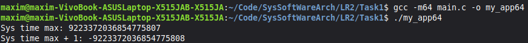
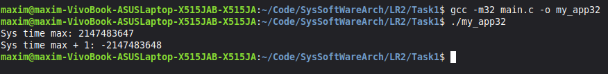
---

## Завдання 2.2: 
Розгляньте сегменти у виконуваному файлі.
1. Скомпілюйте програму &quot;hello world&quot;, запустіть ls -l для
виконуваного файлу, щоб отримати його загальний розмір, і
запустіть size, щоб отримати розміри сегментів всередині нього.
2. Додайте оголошення глобального масиву із 1000 int,
перекомпілюйте й повторіть вимірювання. Зверніть увагу на
відмінності.
3. Тепер додайте початкове значення в оголошення масиву
(пам’ятайте, що C не змушує вас вказувати значення для кожного
елемента масиву в ініціалізаторі). Це перемістить масив із сегмента

BSS у сегмент даних. Повторіть вимірювання. Зверніть увагу на
різницю.
4. Тепер додайте оголошення великого масиву в локальну функцію.
Оголосіть другий великий локальний масив з ініціалізатором.
Повторіть вимірювання. Дані розташовуються всередині функцій,
залишаючись у виконуваному файлі? Яка різниця, якщо масив
ініціалізований чи ні?
5. Які зміни відбуваються з розмірами файлів і сегментів, якщо ви
компілюєте для налагодження? Для максимальної оптимізації?

### Базова програма
Початковий стан програми "Hello World" з мінімальними розмірами сегментів.
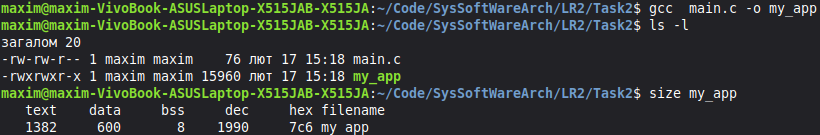

### Глобальний неініціалізований масив
Додавання масиву на 1000 `int`. Сегмент **BSS** зріс, але розмір файлу на диску майже не змінився, оскільки BSS не займає реального місця у файлі.
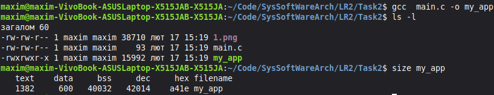

### Глобальний ініціалізований масив
Після надання значень елементам масиву, дані перемістилися в сегмент **Data**. Це призвело до суттєвого збільшення розміру виконуваного файлу.
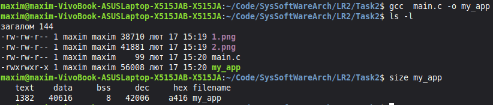

### Локальні змінні та оптимізація
* **Локальні змінні:** Не відображаються у статичних сегментах, оскільки створюються у стеку під час виконання.
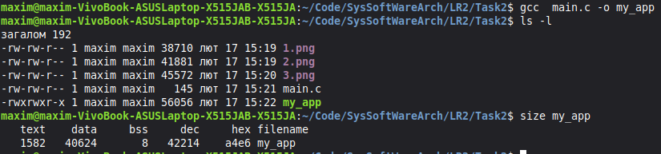
* **Debug (-g):** Збільшує розмір файлу за рахунок метаданих, але не змінює основні сегменти.
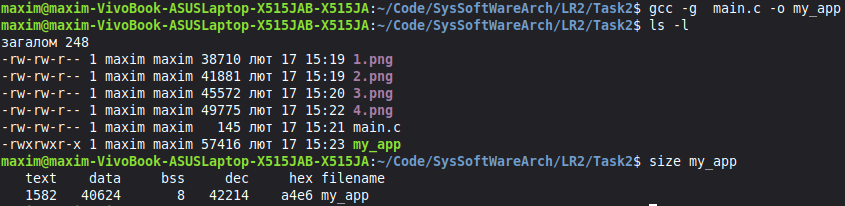
* **Оптимізація (-O3):** Змінює сегмент **Text**, оптимізуючи машинний код.
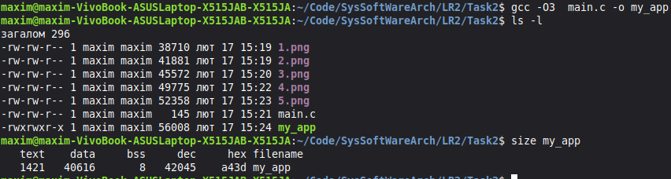
---

## Завдання 2.3: 
Скомпілюйте й запустіть тестову програму, щоб визначити приблизне розташування стека у вашій системі:
---
#include &lt;stdio.h&gt;
int main() {
int i;
printf(&quot;The stack top is near %p\n&quot;, &amp;i);
return 0;
}
---
Знайдіть розташування сегментів даних і тексту, а також купи всередині
сегмента даних, оголосіть змінні, які будуть поміщені в ці сегменти, і
виведіть їхні адреси.
Збільшіть розмір стека, викликавши функцію й оголосивши кілька
великих локальних масивів. Яка зараз адреса вершини стека?
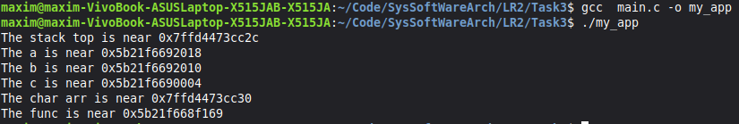
---

## Завдання 2.4: 
* [cite_start]**Аналіз через GDB:** 
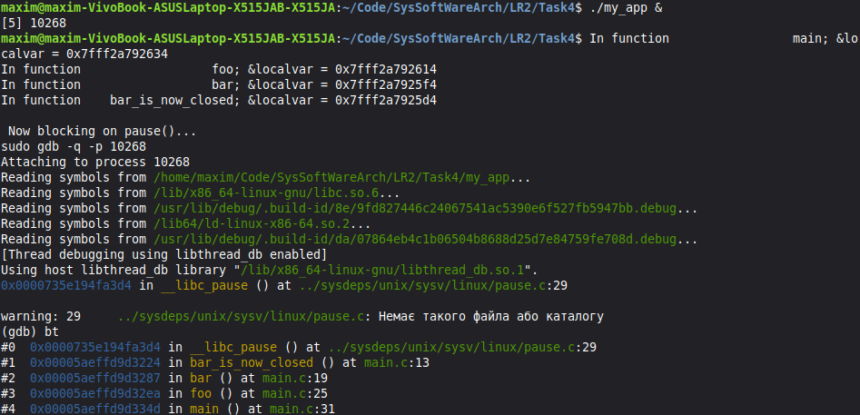
---

## Завдання 2.5: 
**Чи можна обійтися без лічильника команд (IP), використовуючи замість нього вершину стека?**

**Відповідь:** Заміна лічильника команд (IP) вершиною стека неможлива. IP необхідний для послідовного зчитування інструкцій із пам'яті, тоді як стек лише зберігає контекст та адреси повернення. Без IP процесор не знатиме, де шукати наступну команду для виконання.**Text**.
---

# Індивідуальне завдання №12: Написання власного завантажувача ELF-файлів

В межах завдання було реалізовано завантажувач об'єктних файлів формату ELF для архітектури x86-64.
* **Парсинг заголовків**: Читання головного заголовка ELF (`elf64_header_t`) та таблиці заголовків секцій.
* **Розподіл пам'яті**: Використання системного виклику `mmap()` для виділення сторінок пам'яті під секції з прапорцем `ALLOC`.
* **Релокація (Relocation)**: Реалізовано механізм налаштування адрес для типів `R_X86_64_64` (абсолютна 64-біт), `R_X86_64_PC32` (відносна 32-біт) та `R_X86_64_32`.
* **Динамічне зв'язування**: Завантажувач знаходить зовнішні символи (наприклад, `printf`, `puts`) в адресному просторі поточного процесу та підставляє їх адреси в об'єктний файл, що завантажується.
* **Запуск коду**: Пошук символу `run` у таблиці символів та передача керування на знайдений вхідний пункт.

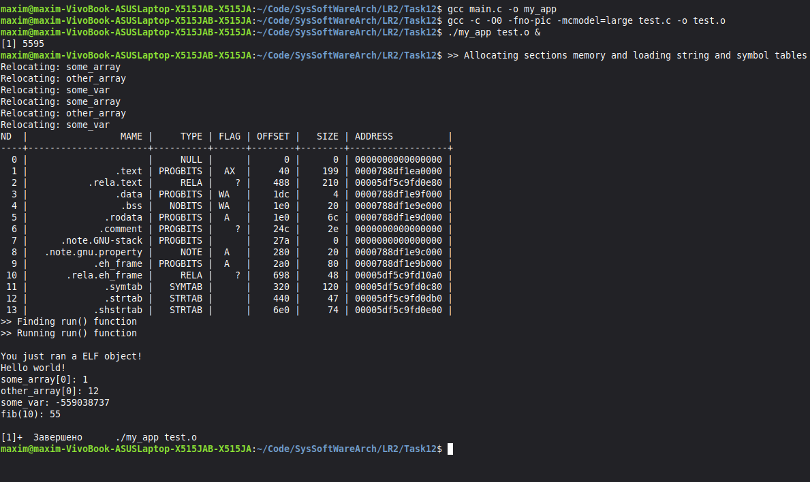

## Висновок
Здобуто навички аналізу ELF-файлів та розподілу пам'яті за сегментами .text, .data, .bss. Досліджено механіку роботи стека й регістрів за допомогою gdb, gstack та size. Експериментально підтверджено критичну роль лічильника команд (IP) для керування потоком виконання.