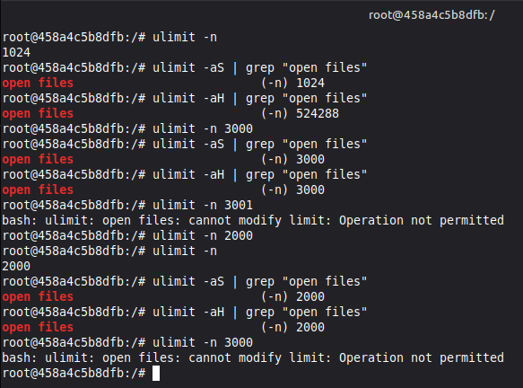
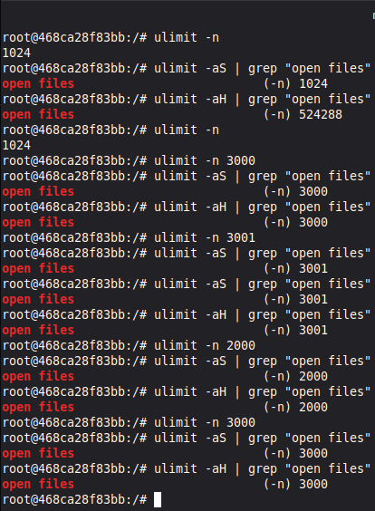
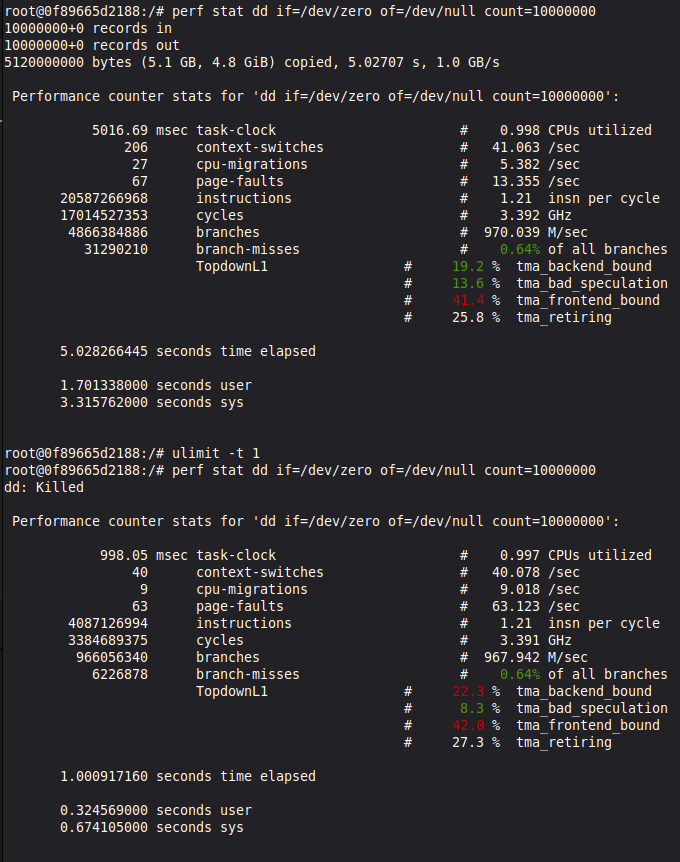
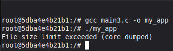
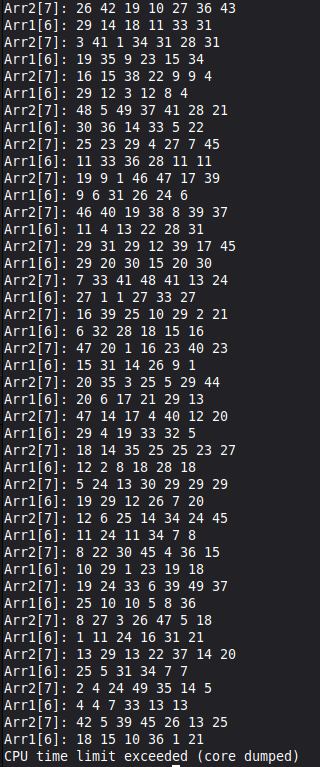
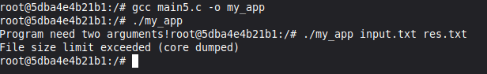
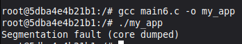
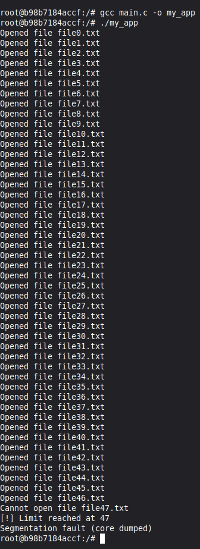

# Практична робота №3: Дослідження обмежень ресурсів у середовищі Docker

**Виконав:** Максим
**Група:** ТВ-43

Дана робота присвячена вивченню механізмів обмеження системних ресурсів процесу за допомогою утиліти `ulimit` у Docker-контейнерах. Досліджуються м'які (Soft) та жорсткі (Hard) ліміти на кількість відкритих файлів, час ЦП та розміри файлів.

---

## Завдання 3.1: 
Запустіть Docker-контейнер і поекспериментуйте з максимальним лімітом ресурсів відкритих файлів. Для цього виконайте команди у вказаному порядку:

Було проведено експерименти зі зміною лімітів на кількість одночасно відкритих файлів у середовищі Docker.

### Основні результати:

---
## Завдання 3.2: 
У Docker-контейнері встановіть утиліту perf(1). Поекспериментуйте з досягненням процесом встановленого ліміту.

---

## Завдання 3.3:
Напишіть програму, що імітує кидання шестигранного кубика. Імітуйте кидки, результати записуйте у файл, для якого попередньо встановлено обмеження на його максимальний розмір (max file size). Коректно обробіть ситуацію перевищення ліміту.

---

## Завдання 3.4:
Напишіть програму, що імітує лотерею, вибираючи 7 різних цілих чисел у діапазоні від 1 до 49 і ще 6 з 36. Встановіть обмеження на час ЦП (max CPU time) і генеруйте результати вибору чисел (7 із 49, 6 із 36). Обробіть ситуацію, коли ліміт ресурсу вичерпано.

---

## Завдання 3.5: 
Напишіть програму для копіювання одного іменованого файлу в інший. Імена файлів передаються у вигляді аргументів.
Програма має:
перевіряти, чи передано два аргументи, інакше виводити "Program need two arguments";
перевіряти доступність першого файлу для читання, інакше виводити "Cannot open file .... for reading";
перевіряти доступність другого файлу для запису, інакше виводити "Cannot open file .... for writing";
обробляти ситуацію перевищення обмеження на розмір файлу.

---

## Завдання 3.6: 
Напишіть програму, що демонструє використання обмеження (max stack segment size). Підказка: рекурсивна програма активно використовує стек.

---

## Індивідуальне завдання (Варіант №12)
[cite_start]**Тема: Дослідження обмеження динамічної пам’яті процесу (`ulimit -d`)**[cite: 244].

* **Завдання**: Написати програму, що інтенсивно виділяє пам'ять у купі (heap) за допомогою `malloc()`.
* **Експеримент**: Визначити вплив ліміту `-d` на успішність виділення великих блоків пам'яті.
* **Результат**: При встановленні низького значення `ulimit -d` наступні запити до `malloc()` повертають `NULL`, що змушує програму коректно звільняти ресурси або завершувати роботу з повідомленням про помилку.

---

## Висновок
Опановано механізми обмеження системних ресурсів за допомогою ulimit у середовищі Docker. Проаналізовано вплив м'яких і жорстких лімітів на кількість відкритих файлів, час ЦП та розмір даних. Доведено, що перевищення лімітів призводить до контрольованого переривання процесів операційною системою.