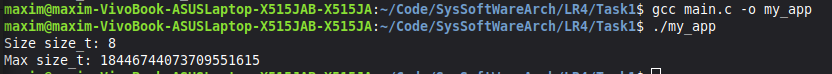
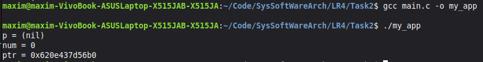
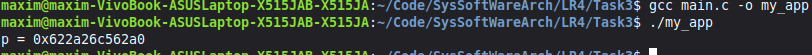
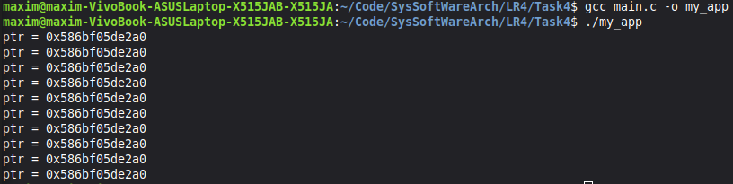
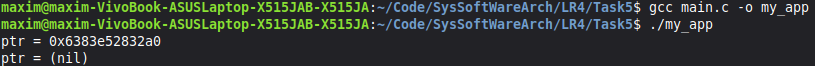
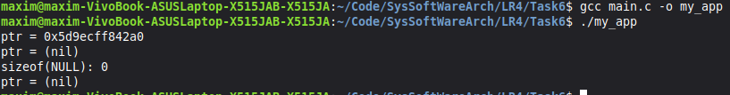
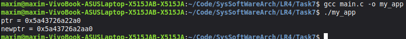
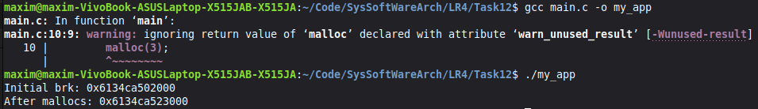

# Практична робота №4: Робота з пам'ятю

**Виконав:** Максим
**Група:** ТВ-43

Дана робота присвячена вивченню malloc(), realloc(), sbrk()

---

## Завдання 4.1: 
Скільки пам’яті може виділити malloc(3) за один виклик?
Параметр malloc(3) є цілим числом типу даних size_t, тому логічно максимальне число, яке можна передати як параметр malloc(3), — це максимальне значення size_t на платформі (sizeof(size_t)). У 64-бітній Linux size_t становить 8 байтів, тобто 8 * 8 = 64 біти. Відповідно, максимальний обсяг пам’яті, який може бути виділений за один виклик malloc(3), дорівнює 2^64. Спробуйте запустити код на x86_64 та x86. Чому теоретично максимальний обсяг складає 8 ексабайт, а не 16?

### Основні результати:

---
## Завдання 4.2: 
Що станеться, якщо передати malloc(3) від’ємний аргумент? Напишіть тестовий випадок, який обчислює кількість виділених байтів за формулою num = xa * xb. Що буде, якщо num оголошене як цілочисельна змінна зі знаком, а результат множення призведе до переповнення? Як себе поведе malloc(3)? Запустіть програму на x86_64 і x86.

---

## Завдання 4.3:
Що станеться, якщо використати malloc(0)? Напишіть тестовий випадок, у якому malloc(3) повертає NULL або вказівник, що не є NULL, і який можна передати у free(). Відкомпілюйте та запустіть через ltrace. Поясніть поведінку програми.

---

## Завдання 4.4:
Чи є помилки у такому коді?
---

void *ptr = NULL;
while (<some-condition-is-true>) {
    if (!ptr)
        ptr = malloc(n);
    [... <використання 'ptr'> ...]
    free(ptr);
}
---

Напишіть тестовий випадок, який продемонструє проблему та правильний варіант коду.

---

## Завдання 4.5: 
Що станеться, якщо realloc(3) не зможе виділити пам’ять? Напишіть тестовий випадок, що демонструє цей сценарій.

---

## Завдання 4.6: 
Якщо realloc(3) викликати з NULL або розміром 0, що станеться? Напишіть тестовий випадок.

---

## Завдання 4.7: 
Перепишіть наступний код, використовуючи reallocarray(3):
---

struct sbar *ptr, *newptr;
ptr = calloc(1000, sizeof(struct sbar));
newptr = realloc(ptr, 500*sizeof(struct sbar));
---

Порівняйте результати виконання з використанням ltrace.

---

## Індивідуальне завдання (Варіант №12)

* **Завдання**: Перевірити, як змінюється program break через sbrk(0) після серії малих алокацій.
* **Результат**: ППочаткова межа 0x6134ca502000 після 100 викликів malloc(3) змістилася до 0x6134ca523000. Незважаючи на те, що сумарно було запитано лише 300 байт, межа змістилася на 0x21000 байт. Це підтверджує стратегію glibc malloc: бібліотека запитує у ядра пам'ять великими блоками (сторінками), щоб мінімізувати кількість системних викликів, і самостійно розподіляє її під дрібні потреби процесу.

---

## Висновок:
Вивчено алгоритми роботи malloc, free та realloc і їхню взаємодію з ядром через системні виклики brk/sbrk. Досліджено стратегію алокації сторінками пам'яті та зміну program break при роботі з кучею. Навченося запобігати витокам пам'яті та помилкам переповнення цілих чисел при алокації.
