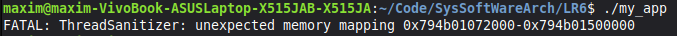

**ПРАКТИЧНА РОБОТА №6**

**ЗАВДАННЯ:**

Реалізувати пул потоків із використанням м’ютексів і змінних умови та перевірити відсутність гонок через ThreadSanitizer.

**Результат роботи:**

Помилка (Data Race) виникає через те, що потік-воркер у функції tpool_worker змінює лічильник tm->thread_cnt-- та викликає pthread_cond_signal вже після того, як основний потік у tpool_destroy міг почати процес видалення м'ютексів та пам'яті. Оскільки доступ до змінної thread_cnt у воркері та її перевірка у tpool_wait відбуваються одночасно без належної синхронізації в момент завершення програми, виникає(race condition), що призводить до звернення до вже звільненої пам'яті або знищених об'єктів синхронізації.

