**ПРАКТИЧНА РОБОТА №7**

**Виконав:** Найдюк Максим
**Група:** ТВ-43

**ЗАВДАННЯ 1:**

Використайте popen(), щоб передати вивід команди rwho (команда UNIX) до more (команда UNIX) у програмі на C.

**Результат роботи:**

На екрані з'явиться список користувачів у локальній мережі (результат rwho). Якщо список довгий, він заповнить екран і зупиниться, очікуючи натискання пробілу або Enter для гортання вниз (робота more).

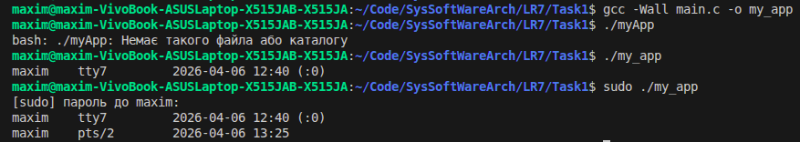

**ЗАВДАННЯ 2:**

 Напишіть програму мовою C, яка імітує команду ls -l в UNIX — виводить список усіх файлів у поточному каталозі та перелічує права доступу тощо.
 (Варіант вирішення, що просто виконує ls -l із вашої програми, — не підходить.)

**Результат роботи:**

Вивід списку файлів та папок у поточному каталозі з їхніми атрибутами.

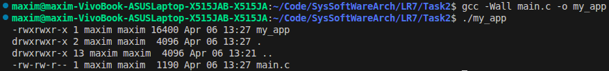

**ЗАВДАННЯ 3:**

 Напишіть програму, яка друкує рядки з файлу, що містять слово, передане як аргумент програми (проста версія утиліти grep в UNIX).

**Результат роботи:**

Програма виведе лише ті цілі рядки з вказаного тексту, у яких зустрічається шукане слово. Якщо слово не знайдено — програма завершиться мовчки, нічого не вивівши.

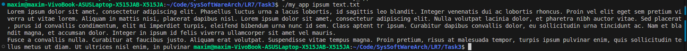

**ЗАВДАННЯ 4:**

Напишіть програму, яка виводить список файлів, заданих у вигляді аргументів, з зупинкою кожні 20 рядків, доки не буде натиснута клавіша (спрощена версія утиліти more в UNIX).

**Результат роботи:**

Текст файлу почне виводитися на екран. Після виводу 10-го рядка програма зупиниться. Після натискання Enter з'являться наступні 10 рядків.

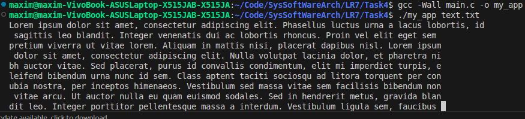

**ЗАВДАННЯ 5:**

Напишіть програму, яка перелічує всі файли в поточному каталозі та всі файли в підкаталогах.

**Результат роботи:**

Простий стовпчик тексту, що містить шляхи до всіх файлів у поточній папці та у всіх папках всередині неї.

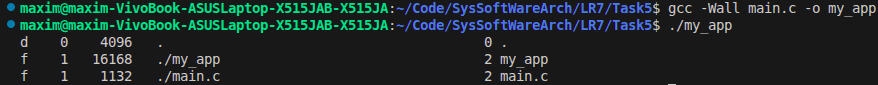

**ЗАВДАННЯ 6:**

Напишіть програму, яка перелічує лише підкаталоги у алфавітному порядку.

**Результат роботи:**

Простий стовпчик тексту, що містить шляхи до всіх файлів у поточній папці та у всіх папках всередині неї, в алфавітному поряку.

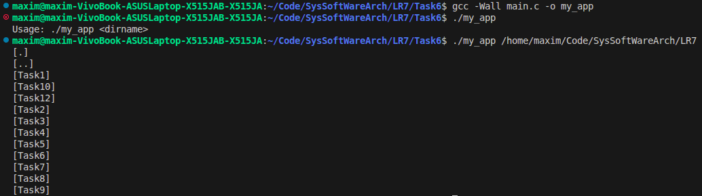

**ЗАВДАННЯ 7:**

Напишіть програму, яка показує користувачу всі його/її вихідні програми на C, а потім в інтерактивному режимі запитує, чи потрібно надати іншим дозвіл на читання (read permission); у разі ствердної відповіді — такий дозвіл повинен бути наданий.

**Результат роботи:**

Інтерактивний діалог у терміналі:
Надати доступ на читання для test.c? (y/n): 
Якщо ввести y, права файлу зміняться. Візуально вивід закінчиться на діалогах, але результат можна буде перевірити через ls -l.

До виконання.
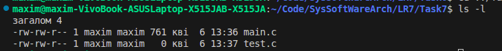

Після виконання.
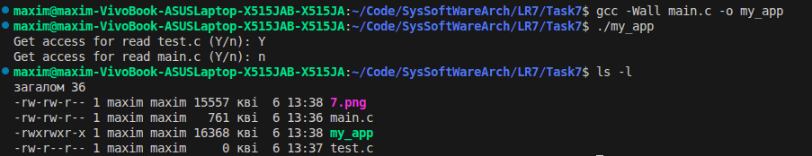

**ЗАВДАННЯ 8:**

Напишіть програму, яка надає користувачу можливість видалити будь-який або всі файли у поточному робочому каталозі. Має з’являтися ім’я файлу з запитом, чи слід його видалити.

**Результат роботи:**

Інтерактивний діалог у терміналі:
Видалення для test.c? (y/n): 
Якщо ввести y, файлу видалится.

До виконання.
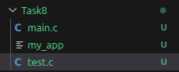

Виконання.
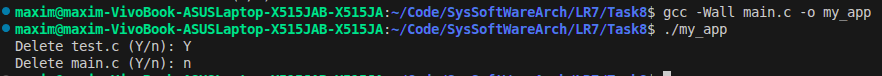

Після виконання.
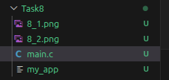

**ЗАВДАННЯ 9:**

Напишіть програму на C, яка вимірює час виконання фрагмента коду в мілісекундах.

**Результат роботи:**

Повідомлення з результатом вимірювання.

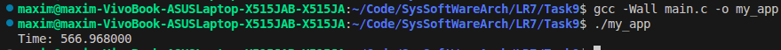

**ЗАВДАННЯ 10:**

Напишіть програму мовою C для створення послідовності випадкових чисел з плаваючою комою у діапазонах:
 (a) від 0.0 до 1.0
 (b) від 0.0 до n, де n — будь-яке дійсне число з плаваючою точкою.
 Початкове значення генератора випадкових чисел має бути встановлене так, щоб гарантувати унікальну послідовність.

**Результат роботи:**

Вивід двох випадкових дробових чисел. При кожному новому запуску програми ці числа будуть різними.

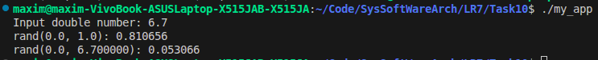

**Індивідуальне завдання:**

Зробіть систему логування запусків програм, яка не використовує жодного лог-файлу.

**Результат роботи:**

Програма створює лог і передає це в систему.

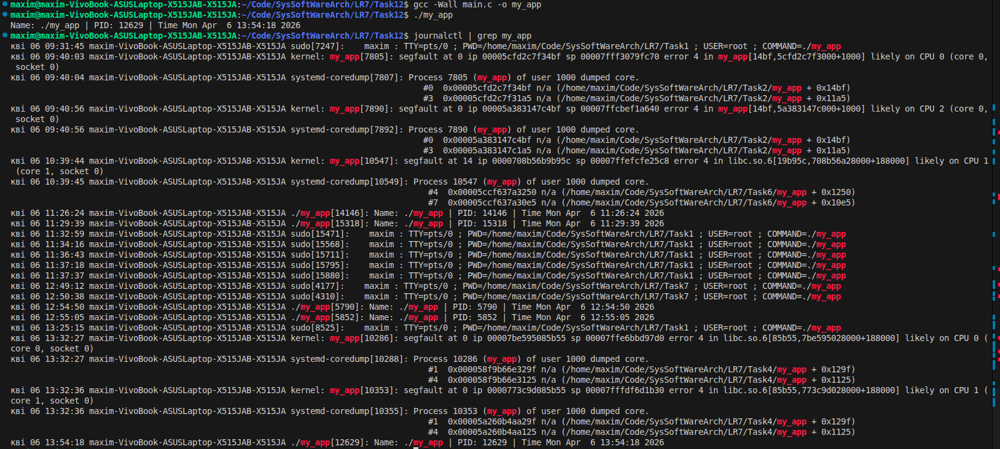

