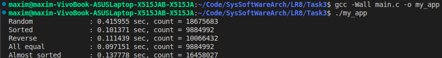
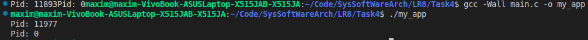
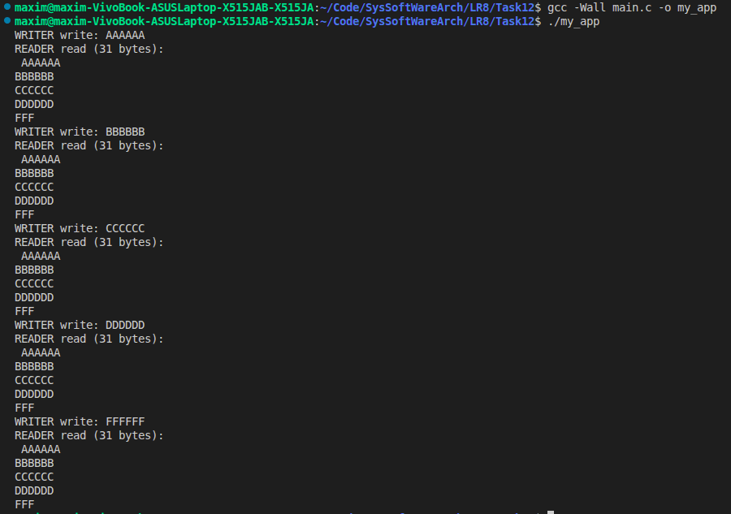

**ПРАКТИЧНА РОБОТА №8**

**Виконав:** Найдюк Максим
**Група:** ТВ-43

**ЗАВДАННЯ 1:**

 Чи може виклик count = write(fd, buffer, nbytes); повернути в змінній count значення, відмінне від nbytes? Якщо так, то чому? Наведіть робочий приклад програми, яка демонструє вашу відповідь.

**Результат роботи:**

Виклик write() може повернути значення, відмінне від запитаного nbytes. Це відбувається у випадку переповнення буфера міжпроцесного каналу (pipe), через що системний виклик призупиняється або записує лише ту частину даних, яка поміщається до заповнення цього ліміту.

**ЗАВДАННЯ 2:**

Є файл, дескриптор якого — fd. Файл містить таку послідовність байтів: 4, 5, 2, 2, 3, 3, 7, 9, 1, 5. У програмі виконується наступна послідовність системних викликів:
lseek(fd, 3, SEEK_SET);
read(fd, &buffer, 4);
де виклик lseek переміщує покажчик на третій байт файлу. Що буде містити буфер після завершення виклику read? Наведіть робочий приклад програми, яка демонструє вашу відповідь.

**Результат роботи:**

Під час виконання заданої послідовності викликів для файлу з даними, виклик lseek(fd, 3, SEEK_SET) переміщує покажчик на третій байт. Тому наступний виклик read() для зчитування 4 байтів заповнить буфер значеннями 2 3 3 7.

**ЗАВДАННЯ 3:**

Бібліотечна функція qsort призначена для сортування даних будь-якого типу. Для її роботи необхідно підготувати функцію порівняння, яка викликається з qsort кожного разу, коли потрібно порівняти два значення.
 
Оскільки значення можуть мати будь-який тип, у функцію порівняння передаються два вказівники типу void* на елементи, що порівнюються.

Напишіть програму, яка досліджує, які вхідні дані є найгіршими для алгоритму швидкого сортування. Спробуйте знайти кілька масивів даних, які змушують qsort працювати якнайповільніше. Автоматизуйте процес експериментування так, щоб підбір і аналіз вхідних даних виконувалися самостійно.

Придумайте і реалізуйте набір тестів для перевірки правильності функції qsort.

**Результат роботи:**

Дослідження вхідних даних для бібліотечної функції qsort()  показало, що сучасні системні реалізації чудово оптимізовані для відсортованих, зворотно відсортованих або однакових даних. Алгоритм працює найповільніше саме на масивах із випадковими числами, що зумовлено інтенсивними промахами кешу та непередбачуваними розгалуженнями процесора під час викликів функції порівняння.

**ЗАВДАННЯ 4:**

 Виконайте наступну програму на мові програмування С:
int main() {
  int pid;
  pid = fork();
  printf("%d\n", pid);
}
Завершіть цю програму. Припускаючи, що виклик fork() був успішним, яким може бути результат виконання цієї програми?

**Результат роботи:**

При виконанні наведеної програми, у разі успішного системного виклику fork() створюється паралельний дочірній процес. В результаті інструкція printf виконується двічі: батьківський процес виводить у термінал ідентифікатор PID створеного нащадка, а дочірній процес завжди отримує значення pid 0, причому порядок їхнього виводу може бути довільним через конкуренцію за ресурси.

**Індивідуальне завдання:**

Зробіть систему логування запусків програм, яка не використовує жодного лог-файлу.

**Результат роботи:**

Програма демонструє надійний механізм паралельної міжпроцесної взаємодії, де процес-«письменник» генерує та відправляє блоки даних (наприклад, AAAAAA, BBBBBB), а процес-«читач» їх послідовно приймає.

