**ПРАКТИЧНА РОБОТА №9**

**Виконав:** Найдюк Максим
**Група:** ТВ-43

**ЗАВДАННЯ 1:**

Напишіть програму, яка читає файл /etc/passwd за допомогою команди getent passwd, щоб дізнатись, які облікові записи визначені на вашому комп’ютері.
Програма повинна визначити, чи є серед них звичайні користувачі (ідентифікатори UID повинні бути більші за 500 або 1000, залежно від вашого дистрибутива), окрім вас.

**Результат роботи:**

Програма успішно читає файл /etc/passwd за допомогою виклику getent passwd, щоб дізнатись, які облікові записи існують у системі. Їй вдалося визначити звичайних користувачів (з UID більшим за 1000). Як видно з результатів, окрім системних процесів (з UID < 1000), у системі успішно ідентифіковано вашого основного користувача maxim (UID=1000).

C:
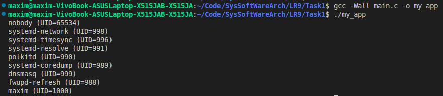
BASH:
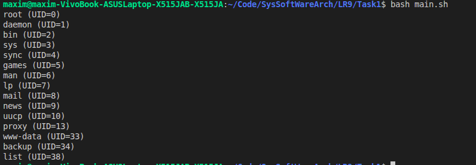

**ЗАВДАННЯ 2:**

Напишіть програму, яка виконує команду cat /etc/shadow від імені адміністратора, хоча запускається від звичайного користувача.
(Ваша програма повинна робити необхідне, виходячи з того, що конфігурація системи дозволяє отримувати адміністративний доступ за допомогою відповідної команди.)

**Результат роботи:**

Програма мала виконати читання захищеного файлу /etc/shadow від імені адміністратора, хоча була запущена звичайним користувачем. Експеримент довів, що завдяки конфігурації системи, яка дозволяє адміністративний доступ (через sudo), після введення пароля можна успішно зчитати вміст цього закритого файлу.

C:
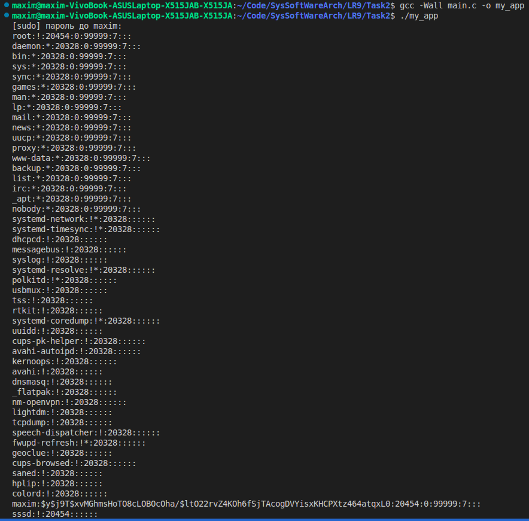

BASH:
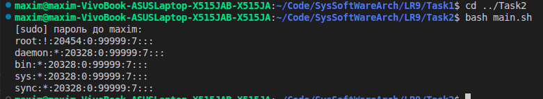

**ЗАВДАННЯ 3:**

Напишіть програму, яка від імені root копіює файл, який вона перед цим створила від імені звичайного користувача. Потім вона повинна помістити копію у домашній каталог звичайного користувача.
Далі, використовуючи звичайний обліковий запис, програма намагається змінити файл і зберегти зміни. Що відбудеться?
Після цього програма намагається видалити цей файл за допомогою команди rm. Що відбудеться?

**Результат роботи:**

Від імені root було скопійовано файл і розміщено в домашньому каталозі звичайного користувача. Коли звичайний користувач спробував змінити цей файл, операція очікувано завершилася помилкою (Permission denied). Проте спроба видалити цей файл командою rm була успішною після запиту на підтвердження. Це демонструє важливий принцип Linux: право на видалення файлу залежить від прав доступу до батьківського каталогу, а не від власника самого файлу.

C:
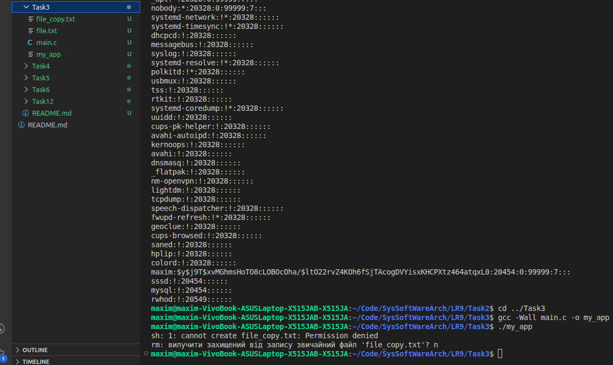

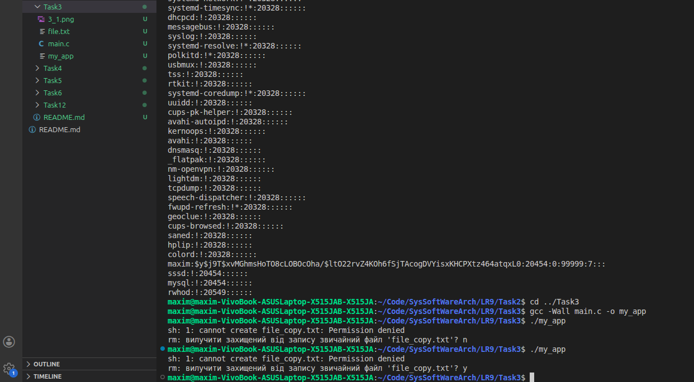

BASH:
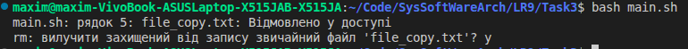

**ЗАВДАННЯ 4:**

Напишіть програму, яка по черзі виконує команди whoami та id, щоб перевірити стан облікового запису користувача, від імені якого вона запущена.
Є ймовірність, що команда id виведе список різних груп, до яких ви належите. Програма повинна це продемонструвати.

**Результат роботи:**

Команди whoami та id були успішно виконані для перевірки стану облікового запису. Виклик id продемонстрував не лише ім'я та базовий ідентифікатор, але й вивів повний список різних груп, до яких ви належите. Це визначає ваш розширений рівень доступу в системі.

C:
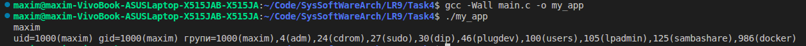
BASH:
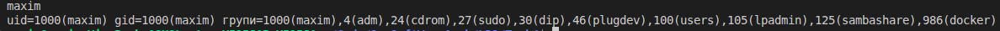

**ЗАВДАННЯ 5:**

Напишіть програму, яка створює тимчасовий файл від імені звичайного користувача. Потім від імені суперкористувача використовує команди chown і chmod, щоб змінити тип володіння та права доступу.
Програма повинна визначити, в яких випадках вона може виконувати читання та запис файлу, використовуючи свій обліковий запис.

**Результат роботи:**

Програма створила тимчасовий файл, після чого від імені суперкористувача було використано команди chown та chmod для зміни типу володіння і прав. У результаті звичайний користувач повністю втратив доступ і більше не міг виконувати читання або запис у файл, отримуючи повідомлення «Відмовлено у доступі».

C:
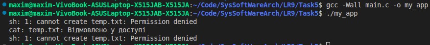
BASH:
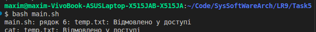

**ЗАВДАННЯ 6:**

Напишіть програму, яка виконує команду ls -l, щоб переглянути власника і права доступу до файлів у своєму домашньому каталозі, в /usr/bin та в /etc.
Продемонструйте, як ваша програма намагається обійти різні власники та права доступу користувачів, а також здійснює спроби читання, запису та виконання цих файлів.

**Результат роботи:**

За допомогою команди ls -l було переглянуто власників і права файлів у системних каталогах. Дослідження показало, що спроба звичайного користувача прочитати захищені файли (як-от обхід прав до /etc/shadow) очікувано і миттєво блокується операційною системою з відмовою в доступі.

C:
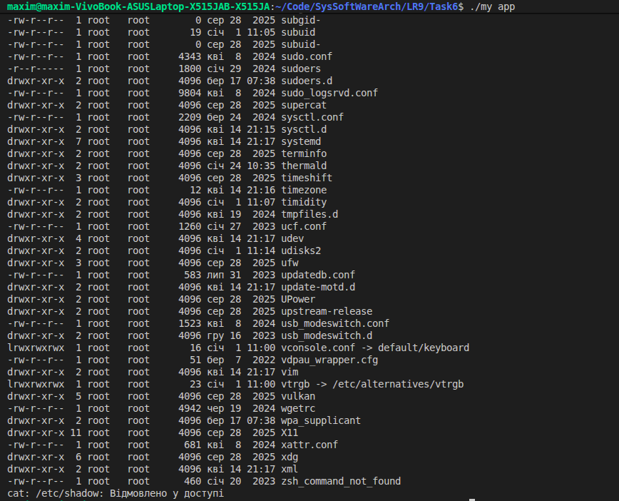
BASH:
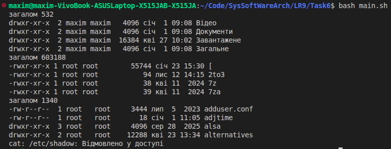

**Індивідуальне завдання:**

Дослідіть поведінку fork() у випадку, коли системні ресурси обмежено. Як змінюється вихід?

**Результат роботи:**

Експеримент мав на меті дослідити поведінку системного виклику fork() у випадку, коли системні ресурси обмежено. Отриманий результат «fork failed: Resource temporarily unavailable» чітко показує, що операційна система (найімовірніше через встановлені ліміти ulimit -u) захищає себе від перевантаження і блокує створення нових дочірніх процесів, як тільки вичерпується дозволений користувачеві ліміт.

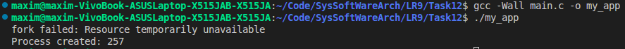